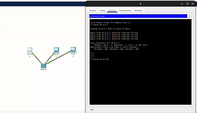
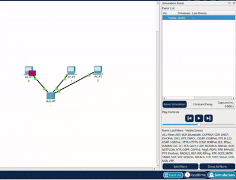
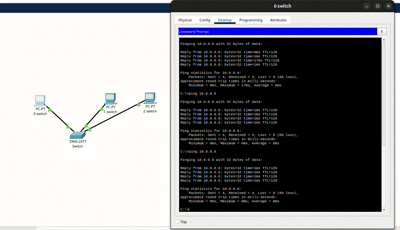
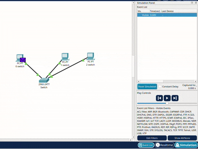
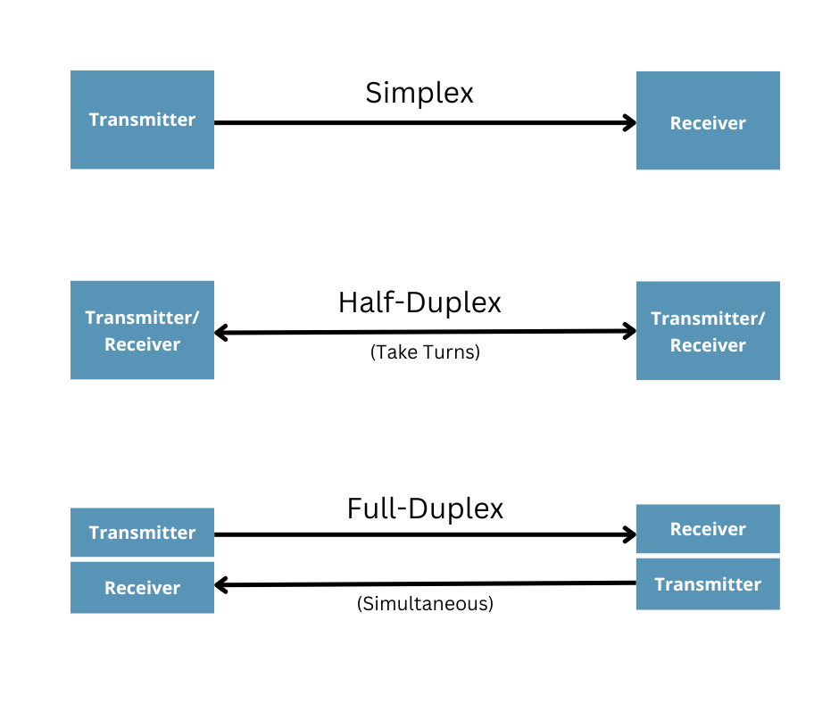

# Camada Física

Relatório técnico da análise experimental de transmissão em camada física e de enlace

[link para o arquivo pkt](camada-fisica.pkt)

[link para a explicacao](explicacao.mp4)

[link para o video no drive](https://drive.google.com/file/d/1naPw9qUuOXZapsW8X6pOE90DOf238hG6/view?usp=sharing)

## PARTE 1: Rede com HUB e análise de propagação do sinal

Visualização do envio do ping:

[video mp4](src/ping-hub.mp4)

Visualização do envio do pdu:

[video mp4](src/pdu-hub.mp4)

**a) Por que todos os nós recebem o quadro inicialmente dentro de um hub?**

Isso ocorre porque o hub funciona, basicamente, como um repetidor: ele apenas recebe a informação e a replica para todos os nós. Ele atua apenas na Camada Física do modelo OSI, dessa forma não sendo capaz de processar endereços MAC ou entender a estrutura de um quadro.

O bloqueio da informação acontece nos próprios computadores que a receberam. Eles leem o quadro e identificam se o endereço MAC de destino é o mesmo que o deles; se for, leem a mensagem. Caso contrário, descartam-na.

**b) Explique como isso se relaciona ao conceito de meio compartilhado com desempenho real na camada física.**

O hub funciona como um link de broadcast ou meio compartilhado, onde múltiplos emissores e receptores estão conectados ao mesmo canal de comunicação.

Se mais de um dispositivo emitir sinais ao mesmo tempo, ocorrerá interferência, resultando em colisão e perda de dados. Dessa forma, exige-se o uso de mecanismos como o CSMA/CD, que verifica antes se o meio está ocioso e realiza backoffs (esperas aleatórias) para tentar a transmissão novamente, caso ainda ocorra colisão.

Isso diminui a eficiência, pois há tempos ociosos durante os backoffs, que se tornam ainda maiores conforme aumenta o número de dispositivos, já que a probabilidade de colisão cresce.

## PARTE 2: Rede com SWITCH e comparação física
Visualização do envio do ping:

[video mp4](src/ping-switch.mp4)

Visualização do envio do pdu:

[video mp4](src/pdu-switch.mp4)

**a) Compare o fluxo do sinal elétrico no switch versus hub.**

**No Hub:** O fluxo é uma inundação (flooding) elétrica simples. O sinal entra por uma porta e sai por todas as outras, independentemente do destino real.

**No Switch:** O fluxo é direcionado. O switch recebe o quadro, lê o cabeçalho da Camada de Enlace, que informa o MAC de destino, e consulta sua tabela de endereços MAC (tabela CAM) para saber para onde enviar. Dessa forma, encaminha exclusivamente para a porta onde o destinatário está localizado.

**b) Por que agora a PDU não é propagada para todos os nós da mesma forma?**

Porque o switch atua na Camada de Enlace, sendo capaz de reconhecer os endereços MAC e filtrar o tráfego para entregar apenas ao destino correto, evitando desperdício de banda nas outras portas.

**c) O switch elimina o meio físico compartilhado? Justifique tecnicamente.**

Sim. Nas redes modernas, o switch substitui a antiga topologia de barramento (meio compartilhado) por links ponto a ponto individuais para cada dispositivo conectado.

Tecnicamente, isso ocorre porque o switch permite a operação em full-duplex, modo de transmissão em que os dados trafegam simultaneamente em ambas as direções.

Para visualizar de forma simples, é como se o cabo deixasse de ser uma rua estreita de mão única e passasse a ser uma rodovia com pistas exclusivas: uma “pista” (ou par de fios/frequência) é dedicada apenas para o sinal ir (transmissão) e outra pista distinta é usada apenas para o sinal voltar (recepção).

Como o transmissor de uma ponta está conectado diretamente ao receptor da outra por meio dos circuitos internos do switch, os sinais nunca tentam ocupar o mesmo caminho físico ao mesmo tempo. Isso elimina completamente as colisões físicas e, por consequência, descarta a necessidade de os dispositivos compartilharem ou disputarem o acesso ao meio, permitindo que cada nó utilize a capacidade total da banda de forma isolada.

